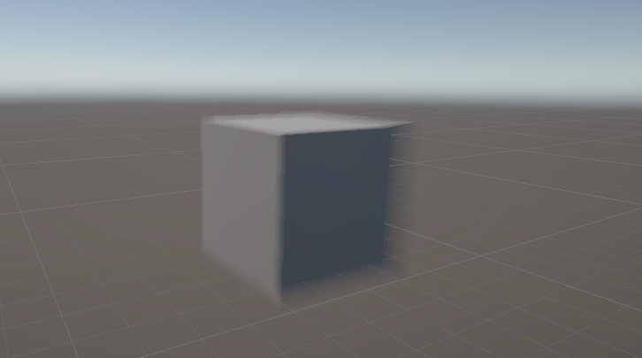

# URP-RendererFeature

### 前言

使用Unity URP后，由于废除了`OnRenderImage()`，原本的后效框架大多失效了，但是Unity官方又引入了`Volume`系统和`Renderer Feature`框架，用来做后处理

想法很好，但是`Renderer Feature`的渲染时机粒度太大，没法在`Volume`中间插入后效，而没法自由选择顺序的后效，就是个cjb（但你还是要学，这应该是URP做后效最官方推荐的做法了）

所以实际建议别用URP，自己用SRP重写一套管线，至少要自己完全实现后效

*话说Unity内置的TAA和Tone Mapping是不是饱受争议啊？*

### 内容

- `ZoomBlur`
  - `ZoomBlur.cs`
  - `ZoomBlurRenderFeature`
  - `ZoomBlur.shader`

- UVOffset
  - `UVOffset.cs`
  - `UVOffsetRenderFeature`
  - `UVOffset.shader`

